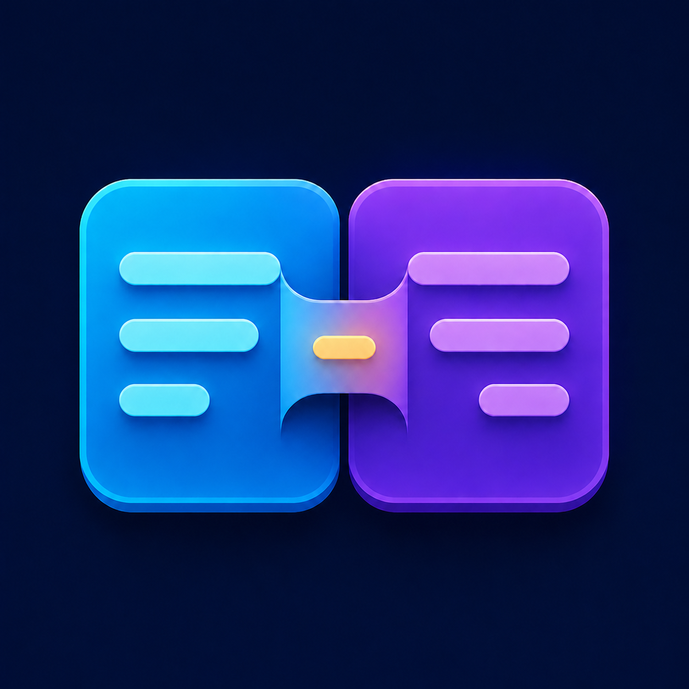
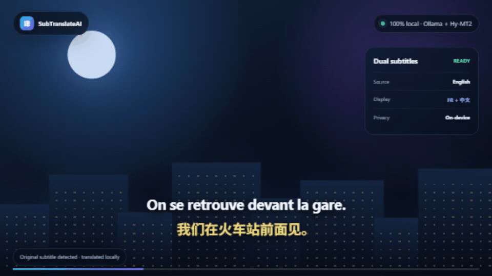
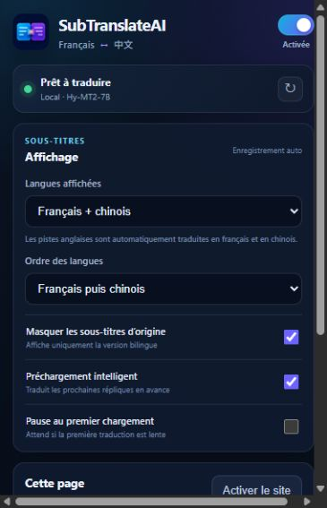

<p align="center">
  
</p>

<h1 align="center">SubTranslateAI</h1>

<p align="center">
  Local, private and bilingual subtitles for Chrome and Edge.<br>
  Translate French, Chinese or English subtitles into French and Chinese with Hy-MT2 running on your own computer.
</p>

<p align="center">
  <a href="https://github.com/Anass-Developper/SubTranslateAI-Releases/releases/latest"></a>
  <a href="https://github.com/Anass-Developper/SubTranslateAI/actions/workflows/ci.yml"></a>
  <a href="LICENSE"></a>
  
  
</p>

<p align="center">
  <strong><a href="https://github.com/Anass-Developper/SubTranslateAI-Releases/releases/latest">Download for Windows</a></strong>
  &nbsp;·&nbsp;
  <a href="docs/README.fr.md">Guide français</a>
  &nbsp;·&nbsp;
  <a href="https://github.com/Anass-Developper/SubTranslateAI/issues/new?template=bug_report.yml">Report a problem</a>
</p>

> SubTranslateAI is an early open-source Windows beta. It needs an existing subtitle track: it does not transcribe audio yet. Streaming websites change frequently, so please [report broken integrations](https://github.com/Anass-Developper/SubTranslateAI/issues/new?template=bug_report.yml).

<p align="center">
  
</p>

<p align="center"><sub>Synthetic demonstration — no film, series or third-party subtitle footage is used.</sub></p>

## At a glance

|                              | SubTranslateAI                                     |
| ---------------------------- | -------------------------------------------------- |
| **Input**                    | Existing English, French or Chinese subtitle track |
| **Output**                   | French, simplified Chinese, or both                |
| **Translation**              | Hy-MT2 through Ollama on your computer             |
| **Data sent to a cloud API** | None in the supported desktop configuration        |
| **Cost after installation**  | No subscription or API key                         |
| **Current platform**         | Windows 10/11 with Chrome or Edge                  |

## Why SubTranslateAI?

- **Private by default:** the official Windows app sends subtitle text only to Ollama on `127.0.0.1`.
- **Two subtitles at once:** show French, Chinese, or both.
- **Three source languages:** French, Chinese and English subtitle tracks are supported.
- **Built for video:** duplicate lines are cached and late translations are discarded to keep playback synchronized.
- **Simple setup:** the desktop app installs Ollama, downloads Hy-MT2 and prepares the browser extension.
- **No subscription or API key:** translation runs locally after the initial model download.
- **Playback controls:** optionally pause during the first translation and resume when it is ready.
- **Diagnostics and updates:** copy a privacy-conscious diagnostic report and install new app releases from the control panel.

Supported integrations currently include YouTube, Netflix, Prime Video, Canal+, Apple TV and Bilibili. Results depend on the subtitle format exposed by each website.

### Controls that stay out of the way

<p align="center">
  
</p>

Choose French, Chinese or both directly from the extension popup. Font size, vertical position, original-subtitle visibility, intelligent preloading and first-load pause are configurable without editing a script.

## Install on Windows

1. Download the latest installer from [GitHub Releases](https://github.com/Anass-Developper/SubTranslateAI-Releases/releases/latest).
2. Start SubTranslateAI and choose **Tout installer**. The first setup downloads Ollama and the Hy-MT2 model (about 4.6 GB).
3. In Chrome or Edge, open `chrome://extensions` or `edge://extensions`, enable **Developer mode**, choose **Load unpacked**, then select the extension folder shown by the app.
4. Open a supported video, enable its original subtitles, then use the SubTranslateAI extension popup.

Windows SmartScreen may display a warning because the installer is not code-signed yet. Verify that the download comes from the release repository above. Never download SubTranslateAI from a third-party mirror.

### Requirements

- Windows 10 or 11, x64
- Chrome or Microsoft Edge
- Around 8 GB of free disk space
- A modern GPU is strongly recommended; 8 GB of VRAM gives a more comfortable experience
- An internet connection for the initial installation and model download only

Ollama can fall back to CPU execution, but live translation will usually be too slow for comfortable video playback.

## How it works

```text
Subtitle track in the browser
          │
          ▼
SubTranslateAI extension ──HTTP on 127.0.0.1──► local server
                                                     │
                                                     ▼
                                                Ollama + Hy-MT2
                                                     │
          translated subtitle ◄──────────────────────┘
```

The server binds only to `127.0.0.1`. External website origins are rejected, requests are rate-limited, payload size is capped, and Ollama endpoints are restricted to localhost. The Electron desktop window uses renderer sandboxing and blocks navigation and popups.

For responsible disclosure, read [SECURITY.md](SECURITY.md). For the exact local-data behavior, read [docs/PRIVACY.md](docs/PRIVACY.md).

## Development

Prerequisites: Node.js 20.18+ (Node.js 24 recommended), npm 10.8+, Ollama and the Hy-MT2 model.

```powershell
git clone https://github.com/Anass-Developper/SubTranslateAI.git
cd SubTranslateAI
npm ci
Copy-Item .env.example apps/local-server/.env
npm run dev
```

Pull the model if it is not already installed:

```powershell
ollama pull hf.co/tencent/Hy-MT2-7B-GGUF:Q4_K_M
```

Useful commands:

```powershell
npm test             # unit and integration tests
npm run lint         # static checks
npm run typecheck    # TypeScript checks
npm run build        # build every workspace
npm run check        # full verification used by CI
npm run package:windows
```

The monorepo contains:

- `apps/extension`: Manifest V3 browser extension and subtitle adapters
- `apps/local-server`: Fastify translation API, SQLite cache and Ollama integration
- `apps/desktop`: Electron control panel, setup assistant and updater
- `packages/shared`: shared types and validation schemas

The packaged app always selects Ollama and Hy-MT2. Provider abstractions still present in the development server are experimental and are not part of the supported desktop product.

## Contributing

Bug reports, website compatibility fixes, subtitle samples and translation-quality evaluations are welcome. Start with [CONTRIBUTING.md](CONTRIBUTING.md), look at the [`good first issue`](https://github.com/Anass-Developper/SubTranslateAI/labels/good%20first%20issue) label, or open a feature request.

Please do not upload copyrighted subtitle files. Use short, original or freely licensed examples when creating tests.

## Roadmap

- easier extension distribution through browser stores
- more resilient streaming-site adapters
- a larger, independently reviewed French/Chinese/English evaluation set
- signed Windows installers
- optional local speech-to-text mode

See [ROADMAP.md](ROADMAP.md) for details.

> If SubTranslateAI helps you, [star the repository](https://github.com/Anass-Developper/SubTranslateAI) so other subtitle users can discover it. Installation reports and translation corrections are just as valuable.

## License and attribution

SubTranslateAI source code is licensed under the [Apache License 2.0](LICENSE). Hy-MT2 and Ollama are separate projects downloaded by the installer and keep their own licenses. See [THIRD_PARTY_NOTICES.md](THIRD_PARTY_NOTICES.md).

SubTranslateAI is an independent project and is not affiliated with YouTube, Netflix, Amazon, Canal+, Apple or Bilibili.

---

Documentation française : [docs/README.fr.md](docs/README.fr.md)
